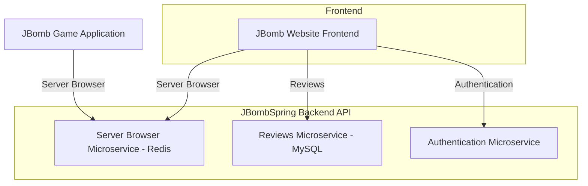

# JBomb Backend

Backend for the **JBomb game** and its website, implemented with Spring Boot framework in Java.  
It provides a **server browser** for active game servers, handles **user reviews**, **user authentication**, and uses **Redis** for fast in-memory caching.

## Features

### 1. Server Browser
- Users can view all **active game servers** either on the website or directly in the **JBomb game client**.
- JBomb Game servers send **periodic heartbeats** to the backend to indicate they are active.
- The backend stores server information in **Redis** for fast retrieval and automatic expiration of inactive servers.

### 2. Game Reviews
- Users can submit reviews for the game via the website.
- Reviews include **author**, **content**, and **rating**.
- Reviews are persisted in **MySQL** using **Spring Data JPA** and **Hibernate**.

### **3. Authentication**
* Users can register new accounts through the auth service.
* Login returns a **JWT token** used to authenticate future requests.
* Authenticated users can retrieve their profile information via the API.

## Architecture

## Server Browser Flow
1. Game servers send a POST request with server info (IP, port, etc.) to `/servers`.
2. Backend stores the server in Redis with a **time-to-live (TTL)** of 60 seconds.
3. The JBomb game client or website queries `/servers` to get the list of active servers.
4. Servers that stop sending heartbeats automatically expire from Redis.

## Reviews Flow
1. Users submit reviews through `/reviews` endpoint on the website.
2. Reviews are persisted in MySQL using JPA/Hibernate.
3. Users can fetch all reviews via GET `/reviews`.

## **Auth Flow**
1. Users register via `POST /api/auth/register`, creating an account in MySQL.
2. Users log in through `POST /api/auth/login`, and a JWT token is generated on success.
3. Authenticated users can fetch their profile via `GET /api/auth/me` using the JWT.

## Technical Stack

- **Backend Framework:** Spring Boot
- **ORM:** Hibernate
- **Database:** MySQL 8.x
- **In-Memory Cache:** Redis
- **Java Version:** 21+
- **Build Tool:** Gradle
- **Testing:** JUnit 5

## API Endpoints

### Server Browser

| Method | URL        | Description                           |
| ------ | ---------- | ------------------------------------- |
| GET    | `/servers` | Get all active servers                |
| POST   | `/servers` | Add a new server or refresh heartbeat |

### Game Reviews

| Method | URL                                                          | Description                        |
| ------ | ------------------------------------------------------------ | ---------------------------------- |
| GET    | `/reviews`                                                   | Get all reviews                    |
| GET    | `/reviews/author={author}/content={content}/rating={rating}` | Submit a review via path variables |

### **Auth**

| Method | URL                  | Description              |
| ------ | -------------------- | ------------------------ |
| POST   | `/api/auth/register` | Register a new user      |
| POST   | `/api/auth/login`    | Authenticate and get JWT |
| GET    | `/api/auth/me`       | Get current user profile |

---

## Notes

* **Redis** is used for fast, ephemeral storage of active servers in the server browser.
* **MySQL** is used for persistent review data.
* The backend API is used both by the **JBomb game client** and the **frontend website**.

---

## License
Author: Simone Di Berardino
MIT License © 2025
